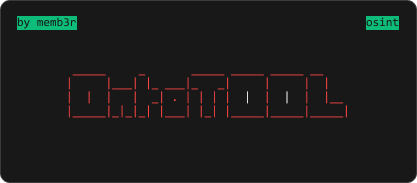

<p align='center'>
  
</p>

<p align="center">
   
</p>

<p align="center">
  Version: 1.0.0
</p>

# Preview <i>(IP lookup example)</i>

```bash
 _____     _       _____ _____ _____ __    
|     |___| |_ ___|_   _|     |     |  |   
|  |  |   |  _| . | | | |  |  |  |  |  |__ 
|_____|_|_|_| |___| |_| |_____|_____|_____| v1.0.0

[!] Hi! Welcome to OntoTOOL - proffesional OSINT tool. There you can find information from Open Sources.
[!] Author: https://github.com/memb3r/
[!] Type "help" to see all commands.

[?] Input answer here: ip
[IP]:
    [?] Input IP here: 8.8.8.8
    [!] Searching information...
    [+] IP: 8.8.8.8
    [+] Network: 8.8.8.0/24
    [+] Version: IPv4
    [+] City: Mountain View
    [+] Region: California
    [+] Region Code: CA
    [+] Country: US
    [+] Country Name: United States
    [+] Country Code: US
    [+] Country Code ISO3: USA
    [+] Country Capital: Washington
    [+] Country TLD: .us
    [+] Continent Code: NA
    [+] In Europe: False
    [+] Postal: 94043
    [+] Latitude: 37.42301
    [+] Longitude: -122.083352
    [+] Timezone: America/Los_Angeles
    [+] UTC Offset: -0800
    [+] Country Phone Code: +1
    [+] Currency: USD
    [+] Currency Name: Dollar
    [+] Languages: en-US,es-US,haw,fr
    [+] Country Area: 9629091.0
    [+] Country Population: 327167434
    [+] ASN: AS15169
    [+] Organisation: GOOGLE
    [!] Searching information on whatismyipaddress.com...
    [+] whatismyipaddress.com URL: https://whatismyipaddress.com/ip/8.8.8.8
    [!] Searching geolocation...
    [+] Google Maps URL: https://www.google.com/maps/search/37.42301+-122.083352
[?] Input answer here:
```

# Installation <i>(using apt)</i>

1. Installing <code>git</code> and <code>pip</code>:
```bash
sudo apt install git python3-pip
```

2. Cloning the repo:
```bash
git clone https://github.com/memb3r/ontotool
```

3. Moving to repo folder:
```bash
cd ontotool
```

4. Starting OntoTOOL:
```bash
python3 ontotool.py
```

Full docs for other Operating Systems: <a href='https://github.com/memb3r/ontotool/blob/main/INSTALLDOCS.md'>Click!</a>

# Usage

After starting the program, OntoTOOL will install needed libraries like <code>requests</code>, <code>bs4</code> and others by itself <i>(if you have <code>pip</code> installed)</i>.
After program will install libraries, it will crash, so restart it.

Commands:
```bash
[?] Input answer here: help
[HELP]:
    [!]       Author: https://github.com/memb3r/
    [help]    Shows this help message.
    [phone]   Shows information about phone number.
    [ip]      Shows information about IP address.
    [user]    Shows information about username.
    [email]   Shows information about email.
```

# Tested on

| OS/Service                | Domain                                 | Tested?          |
| --------------------------| -------------------------------------- | ---------------- |
| Codedamn                  | codedamn.com                           | ✅              |
| Replit                    | repl.it                                | ✅              |
| Ubuntu                    | ubuntu.com                             | ✅              |
| Other OS/Services         | None                                   | ❌              |
